# Class Diagram - Bespoked Bikes

This diagram shows the object-oriented class structure for the Bespoked Bikes sales tracking system.

```mermaid
classDiagram
    class Customer {
        -UUID id
        -string name
        -string email
        -string phone
        -string address
        -string city
        -string state
        -string postalCode
        -DateTime createdAt
        -DateTime updatedAt
        +Customer(name, email, phone, address)
        +updateContactInfo(email, phone, address)
    }

    class Salesperson {
        -UUID id
        -UUID employeeId
        -string firstName
        -string lastName
        -string email
        -string phone
        -DateTime startDate
        -DateTime terminationDate
        -DateTime createdAt
        -DateTime updatedAt
        +Salesperson(firstName, lastName, email, phone)
    }

    class Employee {
        -UUID id
        -string firstName
        -string lastName
        -string email
        -string phone
        -string location
        -DateTime hireDate
        -DateTime createdAt
        -DateTime updatedAt
        +Employee(firstName, lastName, email, location)
        +updateContactInfo(email, phone)
    }

    class Product {
        -UUID id
        -string productType
        -string name
        -string description
        -string manufacturer
        -decimal costPrice
        -decimal retailPrice
        -decimal commissionPercentage
        -DateTime createdAt
        -DateTime updatedAt
        +Product(name, type, manufacturer, costPrice, retailPrice)
        +updatePricing(costPrice, retailPrice)
        +setCommissionRate(percentage)
    }

    class Inventory {
        -UUID id
        -UUID productId
        -string location
        -int quantity
        -DateTime createdAt
        -DateTime updatedAt
        +Inventory(productId, location, quantity)
    }

    class Sale {
        -UUID id
        -UUID customerId
        -UUID salespersonId
        -UUID productId
        -decimal salePrice
        -decimal commissionAmount
        -string saleChannel
        -string location
        -DateTime saleDate
        -DateTime createdAt
        -DateTime updatedAt
        +Sale(customer, salesperson, product, salePrice, channel, location)
    }

    class CommissionReport {
        -int year
        -int quarter
        -UUID salespersonId
        -string salespersonName
        -decimal totalCommission
        -int totalSales
        -List~Sale~ sales
        +CommissionReport(year, quarter, salespersonId)
        +addSale(sale)
        +calculateTotals()
    }

    class SalesService {
        -ISaleRepository saleRepository
        -IProductRepository productRepository
        -IInventoryRepository inventoryRepository
        +createSale(customerId, salespersonId, productId, salePrice, channel, location) Sale
        +calculateCommission(sale) decimal
        +getSaleById(id) Sale
        +getSalesByDateRange(startDate, endDate) Sale[]
        +getSalesByCustomer(customerId) Sale[]
        +getSalesBySalesperson(salespersonId) Sale[]
        +getSalesByLocation(location) Sale[]
    }

    class ReportingService {
        -ISaleRepository saleRepository
        -ISalespersonRepository salespersonRepository
        +getQuarterlyCommissionReport(year, quarter) CommissionReport[]
        +getSalespersonQuarterlyReport(salespersonId, year, quarter) CommissionReport
        +getCommissionTotal(salespersonId, startDate, endDate) decimal
    }

    class CustomerService {
        -ICustomerRepository customerRepository
        +createCustomer(name, email, phone, address) Customer
        +getCustomerById(id) Customer
        +updateCustomer(id, updates) Customer
        +searchCustomers(criteria) Customer[]
    }

    class ProductService {
        -IProductRepository productRepository
        -IInventoryRepository inventoryRepository
        +createProduct(name, type, manufacturer, costPrice, retailPrice) Product
        +getProductById(id) Product
        +updateProduct(id, updates) Product
        +updateInventory(productId, location, quantity)
    }

    %% Relationships
    Customer "1" --> "*" Sale : places
    Salesperson "1" --> "*" Sale : makes
    Product "1" --> "*" Sale : sold in
    Product "1" --> "*" Inventory : tracks
    Employee "1" --> "0..1" Salesperson : is a

    SalesService ..> Sale : manages
    SalesService ..> Product : uses
    SalesService ..> Inventory : updates

    ReportingService ..> Sale : queries
    ReportingService ..> Salesperson : queries
    ReportingService ..> CommissionReport : generates

    CustomerService ..> Customer : manages
    ProductService ..> Product : manages
    ProductService ..> Inventory : manages
```



## Key Design Patterns

### Service Layer Pattern

- **SalesService**: Handles all sale-related business logic and orchestration
- **ReportingService**: Generates commission reports and analytics
- **CustomerService**: Manages customer CRUD operations
- **ProductService**: Manages products and inventory

### Repository Pattern (Interfaces)

- `ISaleRepository`, `ICustomerRepository`, `IProductRepository`, etc.
- Abstracts data access layer for testability and flexibility

### Domain Model Pattern?

- Rich domain objects with behavior (not just data)
- Business logic encapsulated within entities

## Method Highlights

### Sale Commission Calculation

```
SalesService.calculateCommission(sale):
  - Retrieves Product.commissionPercentage
  - Applies to Sale.salePrice (not retail price)
  - Stores result in Sale.commissionAmount
```

### Quarterly Reporting

_We can iterate here. Should we have a report object? It would be nice to define that as a config file maybe? User defined reports?_

```
ReportingService.getQuarterlyCommissionReport(year, quarter):
  - Groups sales by calendar quarter
  - Aggregates commission per salesperson
  - Returns CommissionReport objects

ReportingService.getSalespersonQuarterlyReport(salespersonId, year, quarter):
  - Returns commission report for specific salesperson and quarter
```

### Location-Based Operations

```
Sale.location:
  - Tracks where the sale occurred
  - Enables location-based reporting
  - Supports multi-store analysis

SalesService.getSalesByLocation(location):
  - Retrieves all sales for a specific location
  - Useful for location performance analysis
```

## Future Extensibility

1. **Product Types**: `productType` field enables different product categories beyond bicycles
2. **Sale Channels**: `saleChannel` tracks retail vs online vs other future channels
3. **Multi-location**: Both Sale and Inventory support multiple locations for store/warehouse tracking
4. **Commission Flexibility**: Commission calculation is centralized in Sale, allowing future complexity
