# Class Diagram - Bespoked Bikes

This diagram shows the object-oriented class structure for the Bespoked Bikes sales tracking system.

```mermaid
classDiagram
    %% Enumerations
    class EmployeeRole {
        <<enumeration>>
        SALESPERSON
        FULFILLMENT
        ADMIN
    }

    class SaleStatus {
        <<enumeration>>
        PENDING
        FULFILLED
    }

    class Location {
        <<enumeration>>
        STORE
    }

    %% Domain Entities
    class Customer {
        -UUID id
        -string name
        -DateTime createdAt
        -DateTime updatedAt
        +Customer(name)
    }

    class Employee {
        -UUID id
        -string name
        -Location location
        -Set~EmployeeRole~ roles
        -DateTime hireDate
        -DateTime terminationDate
        -DateTime createdAt
        -DateTime updatedAt
        +Employee(name, location)
    }

    class Product {
        -UUID id
        -string productType
        -string name
        -string description
        -string supplier
        -decimal costPrice
        -decimal retailPrice
        -decimal commissionPercentage
        -DateTime createdAt
        -DateTime updatedAt
        +Product(name, type, supplier, costPrice, retailPrice)
    }

    class Inventory {
        -UUID id
        -UUID productId
        -Location location
        -int quantity
        -DateTime createdAt
        -DateTime updatedAt
        +Inventory(productId, location, quantity)
    }

    class Sale {
        -UUID id
        -UUID customerId
        -UUID soldByEmployeeId
        -UUID fulfilledByEmployeeId
        -UUID productId
        -SaleStatus status
        -decimal salePrice
        -decimal commissionAmount
        -string saleChannel
        -Location location
        -DateTime saleDate
        -DateTime fulfilledDate
        -DateTime createdAt
        -DateTime updatedAt
        +Sale(customerId, soldByEmployeeId, productId, salePrice, channel, location)
    }

    class CommissionReport {
        -int year
        -int quarter
        -UUID employeeId
        -string employeeName
        -decimal totalCommission
        -int totalSales
        -List~Sale~ sales
        +CommissionReport(year, quarter, employeeId)
    }

    %% Service Layer
    class SalesService {
        -ISaleRepository saleRepository
        -IProductRepository productRepository
        -IInventoryRepository inventoryRepository
        -IEmployeeRepository employeeRepository
        +createSale(customerId, employeeId, productId, salePrice, channel, location) Sale
        +fulfillSale(saleId, employeeId) void
        +calculateCommission(sale) decimal
        +getSaleById(id) Sale
        +getSalesByDateRange(startDate, endDate) Sale[]
        +getSalesByCustomer(customerId) Sale[]
        +getSalesByEmployee(employeeId) Sale[]
        +getSalesByLocation(location) Sale[]
        +getPendingSales() Sale[]
    }

    class ReportingService {
        -ISaleRepository saleRepository
        -IEmployeeRepository employeeRepository
        +getQuarterlyCommissionReport(year, quarter) CommissionReport[]
        +getEmployeeQuarterlyReport(employeeId, year, quarter) CommissionReport
        +getCommissionTotal(employeeId, startDate, endDate) decimal
    }

    class CustomerService {
        -ICustomerRepository customerRepository
        +createCustomer(name, email, phone, address) Customer
        +getCustomerById(id) Customer
        +updateCustomer(id, updates) Customer
        +searchCustomers(criteria) Customer[]
    }

    class ProductService {
        -IProductRepository productRepository
        -IInventoryRepository inventoryRepository
        +createProduct(name, type, manufacturer, costPrice, retailPrice) Product
        +getProductById(id) Product
        +updateProduct(id, updates) Product
        +updateInventory(productId, location, quantity) void
        +getInventoryByLocation(location) Inventory[]
        +checkAvailability(productId, location) boolean
    }

    class EmployeeService {
        -IEmployeeRepository employeeRepository
        +createEmployee(name, location) Employee
        +getEmployeeById(id) Employee
        +updateEmployee(id, updates) Employee
        +assignRole(employeeId, role) void
        +removeRole(employeeId, role) void
        +getEmployeesByRole(role) Employee[]
        +validateEmployeeCanSell(employeeId) boolean
        +validateEmployeeCanFulfill(employeeId) boolean
    }

    %% Relationships
    Customer "1" --> "*" Sale : places
    Employee "1" --> "*" Sale : "sells (sold_by)"
    Employee "1" --> "*" Sale : "fulfills (fulfilled_by)"
    Product "1" --> "*" Sale : "sold in"
    Product "1" --> "*" Inventory : tracks

    Employee --> EmployeeRole : has roles
    Sale --> SaleStatus : has status
    Sale --> Location : at location
    Employee --> Location : works at
    Inventory --> Location : stored at

    SalesService ..> Sale : manages
    SalesService ..> Product : uses
    SalesService ..> Inventory : updates
    SalesService ..> Employee : validates

    ReportingService ..> Sale : queries
    ReportingService ..> Employee : queries
    ReportingService ..> CommissionReport : generates

    CustomerService ..> Customer : manages
    ProductService ..> Product : manages
    ProductService ..> Inventory : manages
    EmployeeService ..> Employee : manages
```



## Key Design Patterns

### Service Layer Pattern

- **SalesService**: Handles all sale-related business logic, including creation and fulfillment
- **ReportingService**: Generates commission reports and analytics
- **CustomerService**: Manages customer CRUD operations
- **ProductService**: Manages products and inventory
- **EmployeeService**: Manages employees and role assignments

### Repository Pattern (Interfaces)

- `ISaleRepository`, `ICustomerRepository`, `IProductRepository`, `IEmployeeRepository`, etc.
- Abstracts data access layer for testability and flexibility

### Anemic Domain Model Pattern

- Domain entities are simple data holders (DTOs)
- Business logic is encapsulated in service layer
- Clean separation between data and behavior

### Role-Based Composition

- Employees have multiple roles through a `Set<EmployeeRole>`
- Behavior is determined by role membership, not inheritance
- Single employee can perform multiple functions (sales and fulfillment)

## Method Highlights

### Sale Lifecycle

```
SalesService.createSale(customerId, employeeId, productId, ...):
  - Validates employee has SALESPERSON role
  - Creates sale with status = PENDING
  - Calculates and stores commission amount
  - Returns Sale object

SalesService.fulfillSale(saleId, employeeId):
  - Validates employee has FULFILLMENT role
  - Marks sale as FULFILLED
  - Updates fulfilled_by_employee_id
  - Sets fulfilled_date
  - Decrements inventory quantity
```

### Sale Commission Calculation

```
SalesService.calculateCommission(sale):
  - Retrieves Product.commissionPercentage
  - Applies to Sale.salePrice (not retail price)
  - Stores result in Sale.commissionAmount
  - Returns commission amount
```

### Employee Role Management

```
EmployeeService.assignRole(employeeId, role):
  - Adds role to employee's roles set
  - Validates role is valid EmployeeRole enum

EmployeeService.validateEmployeeCanSell(employeeId):
  - Checks if employee has SALESPERSON role
  - Returns boolean

EmployeeService.validateEmployeeCanFulfill(employeeId):
  - Checks if employee has FULFILLMENT role
  - Returns boolean
```

### Quarterly Reporting

```
ReportingService.getQuarterlyCommissionReport(year, quarter):
  - Groups sales by calendar quarter
  - Aggregates commission per employee
  - Returns CommissionReport objects

ReportingService.getEmployeeQuarterlyReport(employeeId, year, quarter):
  - Returns commission report for specific employee and quarter
  - Includes only FULFILLED sales
```

### Inventory Management

```
ProductService.checkAvailability(productId, location):
  - Queries inventory for product at location
  - Returns boolean indicating availability

ProductService.updateInventory(productId, location, quantity):
  - Updates inventory quantity for product at location
  - Called when stock is received or sale is fulfilled
```

## Business Workflow

### Creating a Sale

1. Customer requests product
2. Employee (with SALESPERSON role) creates sale
3. `SalesService.createSale()` validates employee role
4. Sale created with `status = PENDING`
5. Commission calculated and stored

### Fulfilling a Sale

1. Employee (with FULFILLMENT role) retrieves pending sale
2. `SalesService.fulfillSale()` validates employee role
3. Physical product handoff to customer
4. Sale marked as `FULFILLED`
5. Inventory decremented
6. `fulfilled_by_employee_id` and `fulfilled_date` recorded

## Future Extensibility

1. **Product Types**: `productType` field enables different product categories beyond bicycles
2. **Sale Channels**: `saleChannel` tracks retail vs online vs other future channels
3. **Location Expansion**: Location enum can be extended to support multiple stores, warehouses, or online
4. **Additional Roles**: New roles can be added to EmployeeRole enum as needed
5. **Sale Status**: Additional statuses can be added when needed (e.g., CANCELLED, REFUNDED)
6. **Fulfillment Order Entity**: Can be added for more complex fulfillment workflows
7. **Supplier Management**: Supplier and SupplierOrder entities can be added for inventory replenishment. Note that the `supplier` field on Product is currently a string and will become `supplier_id` FK when Supplier entity is added.
8. **Customer Details**: Customer entity can be expanded to include email, phone, and address when needed
