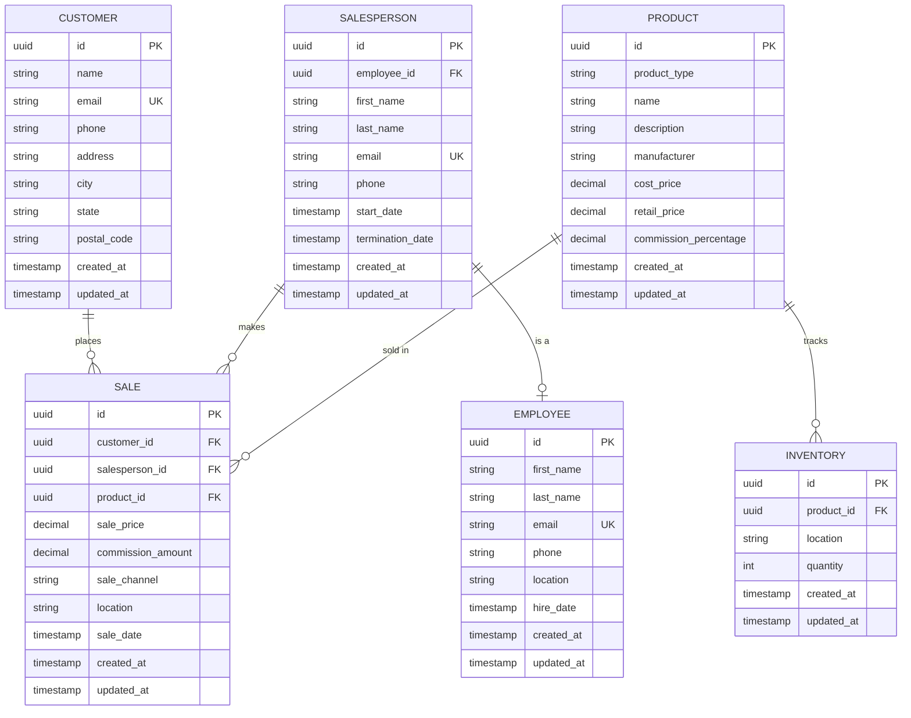

# Entity Relationship Diagram - Bespoked Bikes

This diagram shows the database entities and their relationships for the Bespoked Bikes sales tracking system.

## Key Design Decisions

1. **Commission Storage**: Commission percentage is stored on `PRODUCT`, but the actual commission dollar amount is calculated and stored on each `SALE` to preserve historical accuracy.

2. **Sale Price vs Retail Price**: `SALE.sale_price` can differ from `PRODUCT.retail_price` to accommodate discounts, promotions, or negotiations.

3. **Product Extensibility**: The `product_type` field allows for future expansion beyond bicycles (accessories, services, etc.).

4. **Inventory Tracking**: Separate `INVENTORY` table supports multi-location inventory management with simplified quantity tracking.

5. **Employee Hierarchy**: `SALESPERSON` references `EMPLOYEE` to maintain organizational structure while allowing specialized salesperson data.

6. **Sale Channel**: Track whether sales are retail, online, or other channels for future analysis.

7. **Sale Location**: Each sale records the location where it occurred for location-based reporting and analysis.

## Relationships

- One customer can place many sales (1:N)
- One salesperson can make many sales (1:N)
- One product can be sold in many sales (1:N)
- One product can have inventory at multiple locations (1:N)
- One employee can be a salesperson (1:1 optional)
