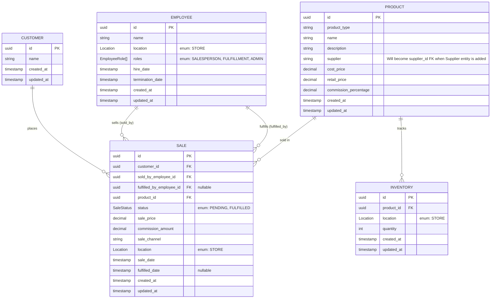

# Entity Relationship Diagram - Bespoked Bikes

This diagram shows the database entities and their relationships for the Bespoked Bikes sales tracking system.



## Enumerations

### EmployeeRole

```
enum EmployeeRole {
    SALESPERSON  // Can create sales
    FULFILLMENT  // Can fulfill sales and manage inventory
    ADMIN        // Administrative access
}
```

### SaleStatus

```
enum SaleStatus {
    PENDING    // Sale created, awaiting fulfillment
    FULFILLED  // Sale completed, product delivered to customer
}
```

### Location

```
enum Location {
    STORE  // Single store location (expandable to multiple locations in future)
}
```

## Key Design Decisions

1. **Employee Role Composition**: Removed separate `SALESPERSON` entity. Employees can have multiple roles through the `roles` array, allowing a single employee to both sell and fulfill orders.

2. **Sale Status Tracking**: Added `status` field to track sale lifecycle. All sales start as `PENDING` and are marked `FULFILLED` after physical handoff to customer.

3. **Dual Employee References**: `SALE` tracks both who sold the product (`sold_by_employee_id`) and who fulfilled it (`fulfilled_by_employee_id`), supporting audit trail and commission tracking.

4. **Commission Storage**: Commission percentage is stored on `PRODUCT`, but the actual commission dollar amount is calculated and stored on each `SALE` to preserve historical accuracy.

5. **Sale Price vs Retail Price**: `SALE.sale_price` can differ from `PRODUCT.retail_price` to accommodate discounts, promotions, or negotiations.

6. **Product Extensibility**: The `product_type` field allows for future expansion beyond bicycles (accessories, services, etc.).

7. **Simplified Customer**: Minimal customer data (just name) - contact details can be added when needed.

8. **Simplified Employee**: Minimal employee data (just name and location) - contact details can be added when needed.

9. **Supplier as String**: The `supplier` field on Product is currently a string. When the Supplier entity is added in future expansion, this will become `supplier_id` FK to enable full supplier relationship management.

10. **Location Enum**: Currently only `STORE`, but using enum allows easy expansion to multiple locations, warehouses, or online channels without schema changes.

11. **Sale Channel**: Track whether sales are retail, online, or other channels for future analysis.

## Relationships

- One customer can place many sales (1:N)
- One employee can sell many products (1:N via sold_by_employee_id)
- One employee can fulfill many sales (1:N via fulfilled_by_employee_id)
- One product can be sold in many sales (1:N)
- One product can have inventory at multiple locations (1:N)

## Future Expansion Entities

These entities were identified in the scenario analysis but are not included in the initial implementation. They can be added when business needs grow:

1. **Fulfillment Order**: For complex fulfillment workflows and tracking delivery obligations
2. **Supplier**: For vendor management and product sourcing
3. **Supplier Order**: For inventory replenishment and purchase order tracking

These will enable more sophisticated inventory management and supplier relationship workflows as the business scales.
