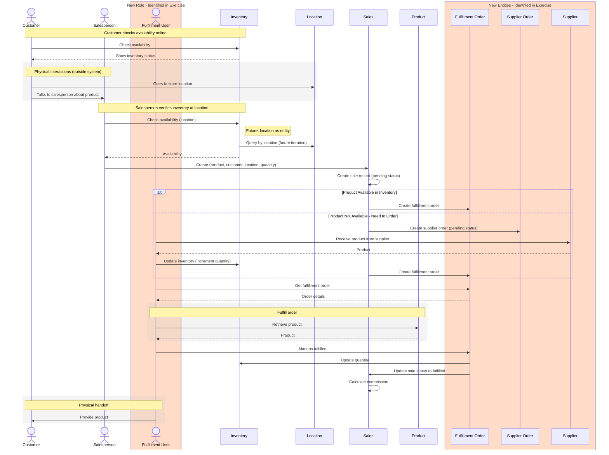

# Sale with Fulfillment Scenario

This sequence diagram represents the scenario identified in the initial sketch, showing the complete flow from sale creation through potential supplier order fulfillment.

## Color Coding & UML Notation

- **Human actors** (stick figures):
  - Customer, Salesperson - existing
  - Fulfillment User - newly identified in exercise
- **UML Message Types**:
  - Solid arrows (`->>`) - Synchronous messages/calls
  - Dashed arrows (`-->>`) - Return messages/responses
- **Physical interactions** (gray rect boxes): Real-world actions outside the system (goes to store, product handoff, etc.)
- **Standard entities** (boxes): Existing system entities (Product, Inventory, Sales)
- **New entities** (orange highlighted boxes): Entities identified during this scenario exercise (Location, Fulfillment Order, Supplier Order, Supplier)
  - Boxes have black outlines
  - Lifecycle lines and boxes are color-coded to indicate newly identified components
  - **Location**: Shown in diagram for future iteration; will likely be implemented as a property on Inventory records rather than a separate entity initially

## Key Insights from This Scenario

### New Entities & Roles Discovered

1. **Location**: Represents a physical store location where sales occur

   - Has location-specific inventory (initially as a property on Inventory)
   - Context for customer visits and sales transactions
   - Links to Inventory to track stock at specific locations

2. **Fulfillment Order**: Represents the obligation to deliver a product to a customer

   - Created for every sale (regardless of stock availability)
   - Links to Sale
   - Tracks fulfillment status (pending, fulfilled)
   - Fulfilled by Fulfillment User who does physical handoff to customer

3. **Supplier Order**: Represents a purchase order placed with a supplier to restock inventory

   - Created only when inventory is insufficient
   - Links to Product
   - Links to Supplier
   - Tracks order status (pending, fulfilled)
   - Processed by Fulfillment User who places order with supplier

4. **Supplier**: External entity that provides products to restock inventory

   - Has supplier contact information
   - Manages product catalog and pricing
   - Processes supplier orders from the system

5. **Fulfillment User** (newly identified role): Human actor who manages both customer fulfillment and supplier ordering
   - Fulfills customer orders by doing physical handoffs
   - Processes supplier orders when inventory is insufficient
   - Places orders with suppliers
   - Receives stock and updates inventory
   - Updates sale status when fulfilled

### Extended Business Flow

This scenario reveals that the system needs to handle:

1. **All Sales Start as Pending**: Every sale starts with "pending" status and is only marked fulfilled after physical handoff
2. **All Sales Create Fulfillment Orders**: Every sale creates a Fulfillment Order to track the delivery obligation
3. **In-Stock Sales**: When inventory is available:
   - Create sale (pending status)
   - Create Fulfillment Order (ready to fulfill)
   - Fulfillment User fulfills order
   - Decrement inventory when fulfilled
   - Update sale to fulfilled status
   - Physical handoff to customer
4. **Out-of-Stock Sales**: When inventory is unavailable:
   - Create sale (pending status)
   - Create Fulfillment Order (pending status)
   - Create Supplier Order to restock
   - Fulfillment User places order with supplier
   - When stock arrives, increment inventory
   - Fulfillment User fulfills the Fulfillment Order
   - Decrement inventory when fulfilled
   - Update sale to fulfilled status
   - Physical handoff to customer

### Impact on Existing Diagrams

This scenario suggests we need to:

- Add **Location** entity to the ERD (initially as a property on Inventory)
- Add **Fulfillment Order** entity to the ERD
- Add **Supplier Order** entity to the ERD
- Add **Supplier** entity to the ERD
- Add **FulfillmentService** to the class diagram
- Update **Sale** entity to include status field (pending, fulfilled, cancelled) and link to Location and Fulfillment Order
- Update **Inventory** to track stock by Location
- Add fulfillment tracking and supplier management capabilities
